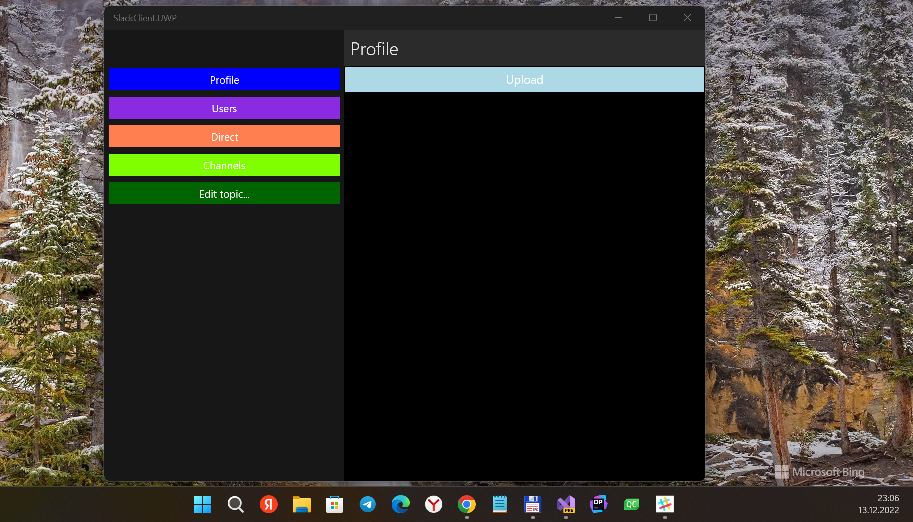

# SlackClient

My fork of SlackClient by kateLap [1]. 

## Screenshot(s)

## My 2 cents
Android/UWP/iOS projects added to SlackClient [2] solution.

## Tech docs
- Requirements: ([Ru](/Documents/Requirements.md))
- UML Diagrams: ([Ru](/Documents/Diagrams/README.md))
- Test Plan: ([Ru](/Documents/Testing/Plan.md))
- Test Results: ([Ru](/Documents/Testing/Results.md))

## Creating your own Slack / Getting API token
https://api.slack.com/apps?new_app=1

## References
- https://github.com/kateLap/ [1]
- https://github.com/kateLap/SlackClient [2]

## ..
AS IS. No support. Proto / RnD only / DIY

## .
[m][e], 2022, December 
